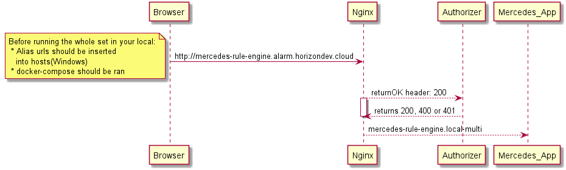

# Definition
This is a setup to access other services through nginx. There are 4 services in total:
 * nginx
 * a simple web application (mercedes app) 
 * another simple web application (audi app)
 * a fake authorizer
 
 We will create the environment on our local. The idea is to call two different web applications that have 
 two different urls through the nginx. We want nginx to know which application to be called based on the url 
 routed to nginx.

## How to run the services
 Since we run the applications on our local, their addresses are actually 
 `http://localhost:<port number>/<path>`. But we want our web applications to be called by alias addresses such as
 `http://mercedes-rule-engine.alias.devenvironment.cloud.` and `http://audi-rule-engine.alias.devenvironment.cloud.`
 To be able to do that, we have to insert those alias to the host file (in case of Windows) like below:
 
    ```
    127.0.0.1 mercedes-rule-engine.alarm.horizondev.cloud
    127.0.0.1 audi-rule-engine.alarm.horizondev.cloud
    ```
    
 We have our web applications defined in docker-compose.yml file. Docker-compose creates a network so each of those services
 defined in that yml file can access to each other through that internal network. We give aliases to the web applications 
 in that yml file and want nginx to parse the address and then according to the name (mercedes or audi), call the responsible
 service.  
 
    
The flow is below.




To be able to access the services 


#Docker compose
* I had a big problem with reaching to the web application from nginx. The reason was port mapping.

    In _docker-compose.yml_ I used the port mapping of `8098:8099`. That means when i want to 
    reach to this service, I should call `localhost:8098`. Therefore, in my _default.conf_ 
    file I used the upstream server address as `localServerAlias:8098;` **That was the problem!**
    
    I actually run nginx and the wep application in the same network. In that case,
    port exposed to the external world, `8098` in my case, should not be used. Changing the 
    configuration in _default.conf_ to    `localServerAlias:8099;` solved the issue. Thanks to [this link][1]

* if you want to create your own interface, take a look to [to that link][2]

[1]: https://forums.docker.com/t/connection-refused-from-upstream/49229
[2]: https://forums.docker.com/t/accessing-host-machine-from-within-docker-container/14248